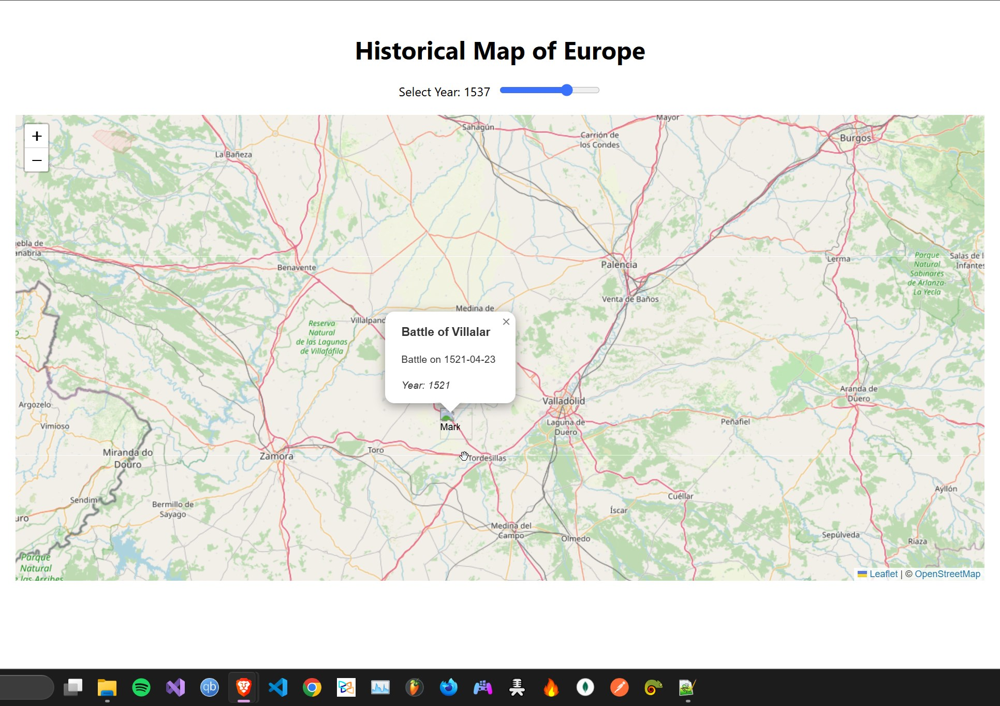

# 🌍 HistoMap — Interactive Historical Timeline Map

HistoMap is a full-stack web app that displays historical events (e.g. battles, philosophers, inventions) on an interactive map of Europe. Users can browse through time using a slider to explore humanity's past, visually.

Built with:
- 🖥️ React + Leaflet for the frontend
- ⚙️ Node.js + Express backend
- 🌐 Wikidata SPARQL as a live external data source (no local DB)

---

## 📸 Preview

 <!-- Add an image here later if you have one -->

---

## 📁 Project Structure

```bash
.
├── client/         # React frontend
│   └── src/
│       └── App.js  # Map + year slider
├── server/         # Node.js backend (Wikidata proxy)
│   └── server.js
├── .gitignore
├── README.md
```

---

## 🚀 Getting Started

### 🔧 Prerequisites

- Node.js (v18+ recommended for native `fetch` support)
- npm or yarn

### 1. Clone the repo

```bash
[git clone https://github.com/HamdanDev/HistoMap.git]
cd histo-map
```

### 2. Install dependencies

```bash
cd client
npm install

cd ../server
npm install
```

### 3. Run the development servers

In separate terminals:

```bash
# Frontend
cd client
npm start
```

```bash
# Backend
cd server
node server.js
```

### 4. Open in browser

Go to: [http://localhost:3000](http://localhost:3000)

---

## 🌐 API Overview

### `GET /api/events?year=1066`

Fetches historical battles (±10 years) from Wikidata using SPARQL and returns:

```json
[
  {
    "id": 0,
    "title": "Battle of Hastings",
    "description": "Battle on 1066-10-14",
    "year": 1066,
    "latitude": 50.9119,
    "longitude": 0.4875,
    "category": "battle"
  },
  ...
]
```

---

## 📦 Technologies Used

### Frontend:
- React
- Leaflet (for interactive maps)
- noUiSlider (optional for custom timeline slider)

### Backend:
- Node.js
- Express
- Axios (for SPARQL queries)

### Data Source:
- Wikidata (live SPARQL API)

---

## 🛡️ Environment & Ignore Setup

Create a `.gitignore` in both root and `/server`:

```gitignore
# Common
node_modules
.env
build
dist
.DS_Store
```

No `.env` is needed unless you add 3rd-party keys later.

---

## 📌 Roadmap / Ideas

- [ ] Add philosophers, artworks, and treaties as event types
- [ ] Load events dynamically when dragging the map or scrolling the timeline
- [ ] Use PostgreSQL for caching data from Wikidata
- [ ] Add offline mode with local dataset
- [ ] Support multi-language content via Wikidata

---

## 🧠 Credits

- [Wikidata Query Service](https://query.wikidata.org/)
- [Leaflet.js](https://leafletjs.com/)
- [React](https://react.dev/)
- [OpenStreetMap tiles](https://www.openstreetmap.org/)

---

## 📜 License

MIT — feel free to fork, modify, and build on it.
